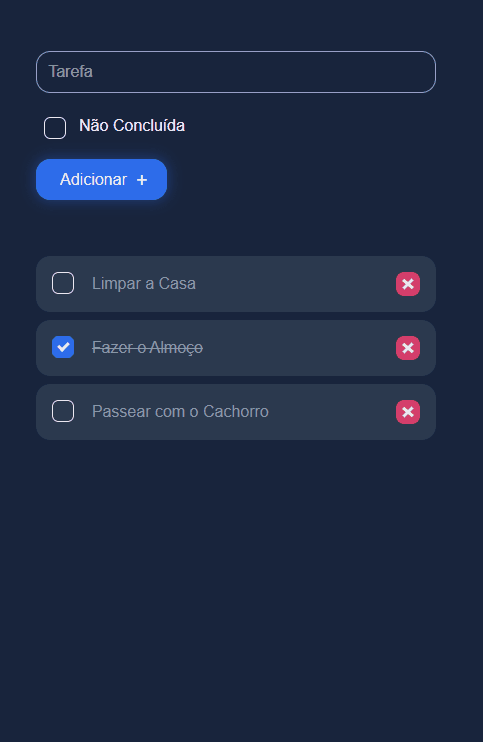

<h1>To-do list</h1>

<h1 align="center">
    
</h1>

<h2>Sobre o Projeto</h2>

Esta aplicação serve para organizar uma lista de tarefas.  
Para isso necessita somente inserir a tarefa, informe se a tarefa foi ou não concluída, clique no botão "Adicionar +", logo abaixo a tarefa será adicionada. Poderá adicionar quantas tarefas desejar, editar se a tarefa foi concluída ou não e até excluir a tarefa que desejar.
 

<h2>Tecnologias</h2>

As seguintes ferramentas foram usada na construção do projeto.

<ul>
    <li>HTML</li>
    <li>CSS</li>
    <li>Javascript</li>
</ul>

<h2>Pré Requisitos para execução do Projeto</h2>

Para iniciar será necessário:

<ul>
    <li>Baixar uma simples <a href="https://github.com/souzasamuelp/apifake">API</a> feita para o projeto</li>
    <li>Instalar VSCode;</li>
    <li>No VSCode, a extensão "Live Server";</li>
</ul>

Abra a API no VSCode, e no terminal execute o "npm run dev", após isso abra o projeto To-do List no VSCode, no terminal execute o "npm run dev" e clique para abrir a página do Live Server, ficará vísivel o projeto e ser executado.

Veja meu linkedin: <a href="https://www.linkedin.com/in/souzasamuelp/">Samuel Souza</a>

Veja meu Github: <a href="https://github.com/souzasamuelp">Samuel Souza</a>
